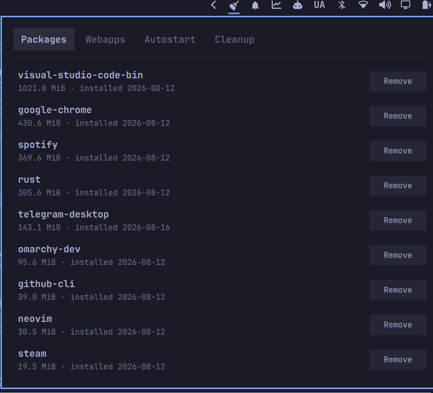

# System Tidy — package/webapp/autostart/cleanup audit for Omarchy

A bar widget for [Omarchy](https://github.com/basecamp/omarchy) that answers
"what's cluttering this system, and what's safe to remove?" in one panel
instead of four separate audits run by hand.



Click the broom in the bar to open a tabbed panel:

- **Packages** — everything installed beyond Omarchy's own default package
  list (`omarchy-base.packages` / `omarchy-other.packages`), with size and
  install date, and a one-click `pacman -Rns` remove.
- **Webapps** — launchers created via `omarchy webapp install`, with a
  one-click remove.
- **Autostart** — merged `~/.config/autostart` and `/etc/xdg/autostart`
  entries, with a one-click disable for anything currently enabled.
- **Cleanup** — pacman package cache, systemd coredumps, and trash size,
  each with a one-click clean.

## Requirements

Stock Omarchy plus `pacman-contrib` (for `paccache`, already a default
package). Package removal and cache cleanup run through `pkexec`, so a
polkit agent must be running (Omarchy ships one by default).

## Install

```bash
omarchy plugin add https://github.com/Loafer19/omarchy-system-tidy --enable
```

## Safety

Package removal runs `pacman -Rns` — dependencies pulled in only for that
package go with it. Nothing is removed without an explicit click in the
panel, and each destructive action requires the same `pkexec` prompt you'd
get running the equivalent command yourself in a terminal.
