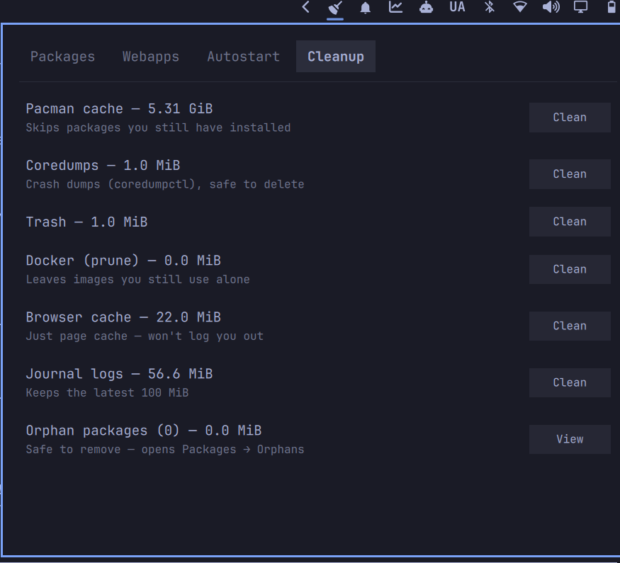

# System Tidy — package/webapp/autostart/cleanup audit for Omarchy

A bar widget for [Omarchy](https://github.com/basecamp/omarchy) that answers
"what's cluttering this system, and what's safe to remove?" in one panel
instead of four separate audits run by hand.


Click the broom in the bar to open a tabbed panel:

- **Packages** — everything installed beyond Omarchy's own default package
  list (`omarchy-base.packages` / `omarchy-other.packages`), with size and
  install date. Toggle to **Orphans** (`pacman -Qtdq`) for packages nothing
  depends on anymore. One-click `pacman -Rns` remove either way.
- **Webapps** — launchers created via `omarchy webapp install`, with a
  one-click remove.
- **Autostart** — merged `~/.config/autostart` and `/etc/xdg/autostart`
  entries, with a one-click disable for anything currently enabled.
- **Cleanup** — pacman cache, coredumps, trash, Docker, browser cache, and
  journal logs, each sized and one-click cleanable, with a short note on
  what the action does and doesn't touch (e.g. browser cache clearing
  doesn't log you out — cookies live in the profile, not the cache dir).
  Orphan packages get a summary row here too, linking back to Packages
  instead of a blind bulk-delete.



The status line confirms what happened — "Done" or "Failed" for a couple
seconds after any action — instead of leaving you guessing whether a click
did anything.

## Requirements

Stock Omarchy plus `pacman-contrib` (for `paccache`, already a default
package). Package removal, pacman cache trimming, coredump/journal cleanup
run through `pkexec`, so a polkit agent must be running (Omarchy ships one
by default). Docker pruning and browser-cache/trash clearing run as your
own user — no elevation needed.

## Install

```bash
omarchy plugin add https://github.com/Loafer19/omarchy-system-tidy --enable
```

## Safety

Package removal runs `pacman -Rns` — dependencies pulled in only for that
package go with it. Docker cleanup is a plain `docker system prune -f`, no
`-a`, so images you're still using are left alone. Nothing runs without an
explicit click in the panel.
